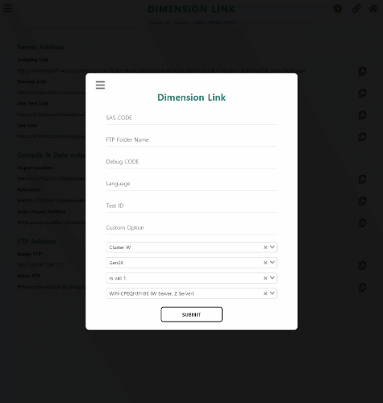

# Link generate site for Dimension
> 편한 링크 테스트와 어디서든 쉽게 링크 공유를 위한 사이트

- 프로젝트를 서버에 올리고 테스트 할 때마다 링크를 하나하나 쳐야하는 불편함 있었음.
- 링크 공유 때 URL을 매번 copy해오고 편집해서 주는 일이 많아 번거로워 줄이고 싶었음.
- 퇴근하고 나서 급한 링크공유 요청이 오거나 테스트 하는 일이 발생할 때 핸드폰에는 저장 된 URL이 없을때 메일함으로 들어가야 하는 번거로움이 있었음.

## 사용법
1. 아래 사이트로 접속 
> 사이트 주소: https://dimensionlink.netlify.com/ 
2. 프로젝트 SAS CODE 입력
3. 엔터나 SUBMIT버튼 누르면 기본셋팅으로 URL이 생성
> 원하는 DebugCode, Language, TestID, Cluster종류 등 편집해서 생성이 가능  
> 각 URL 옆 copy버튼 누르면 복사가 되서 붙여넣기 가능

## 편의기능
- URL을 바로 복사해서 붙여넣기 할 수 있게 copy버튼 제공
- URL에 들어갈 Custom Value들을 변경하기 쉽게 기능 제공
- 이전에 생성했던 코드들은 브라우저 저장소에 저장이 되어 다시 쓰기 용이함
- 모바일로도 접속 가능

## 기술
- Vue.js 2.6.11
- Vuex
- vue-clipboards
- vue-select

## 개발 환경

- [Chrome](https://www.google.com/intl/ko/chrome/)
- [Git](https://git-scm.com/downloads)
- [Visual Studio Code](https://code.visualstudio.com/)
- [Node.js LTS 버전(v10.x 이상)](https://nodejs.org/ko/)
- [Vue.js Dev Tools](https://chrome.google.com/webstore/detail/vuejs-devtools/nhdogjmejiglipccpnnnanhbledajbpd)

## 사이트 주소
> https://dimensionlink.netlify.com/ 
